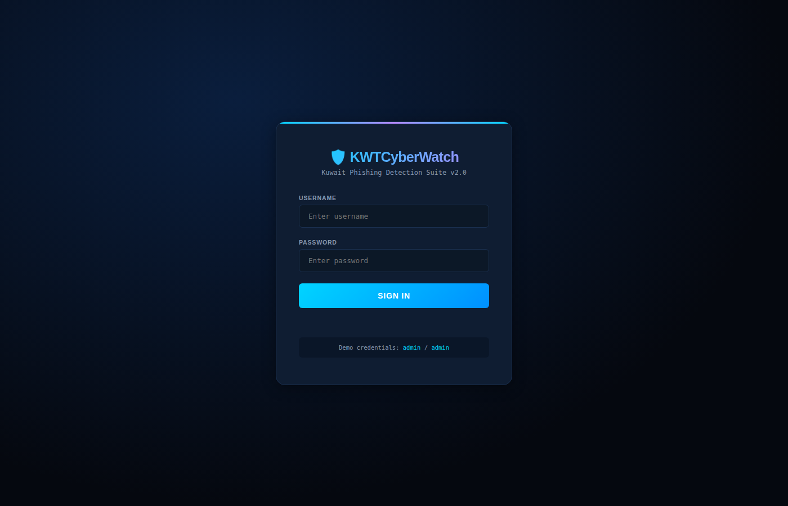
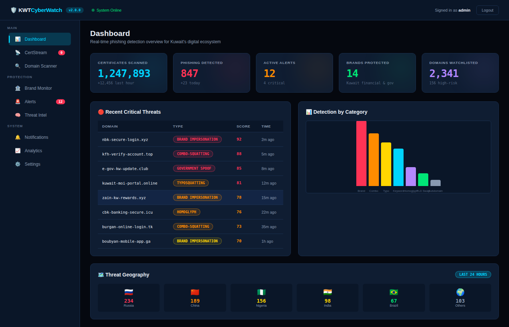
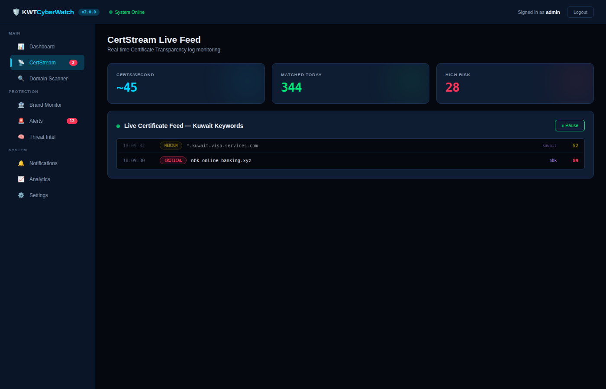
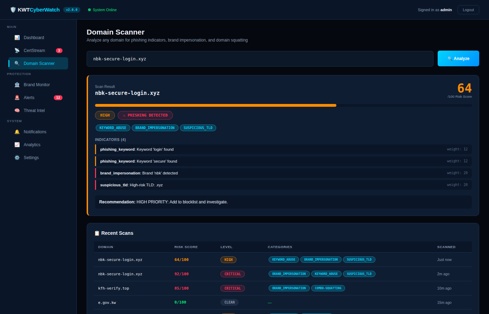
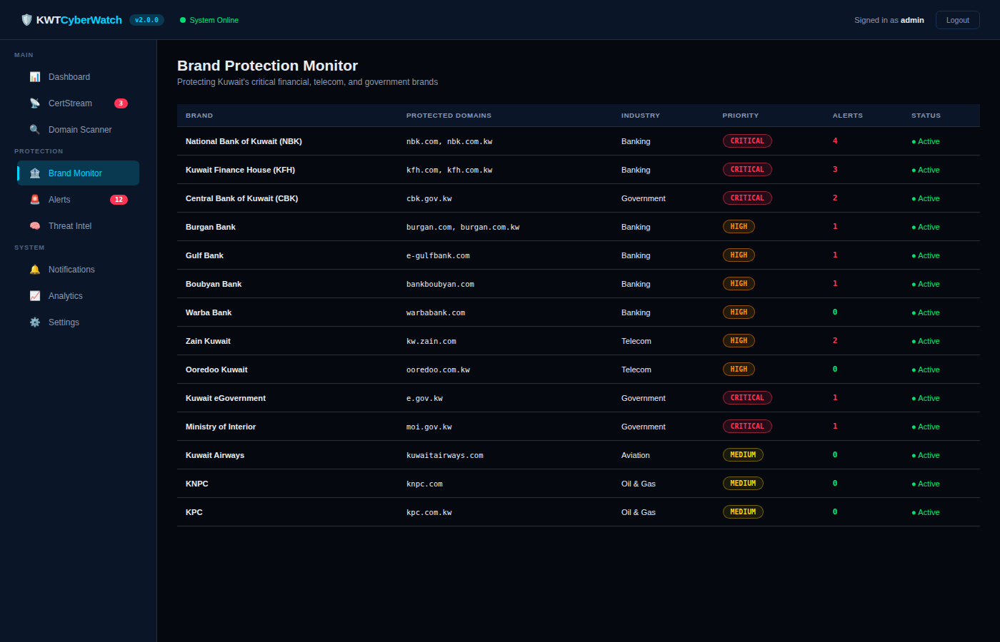
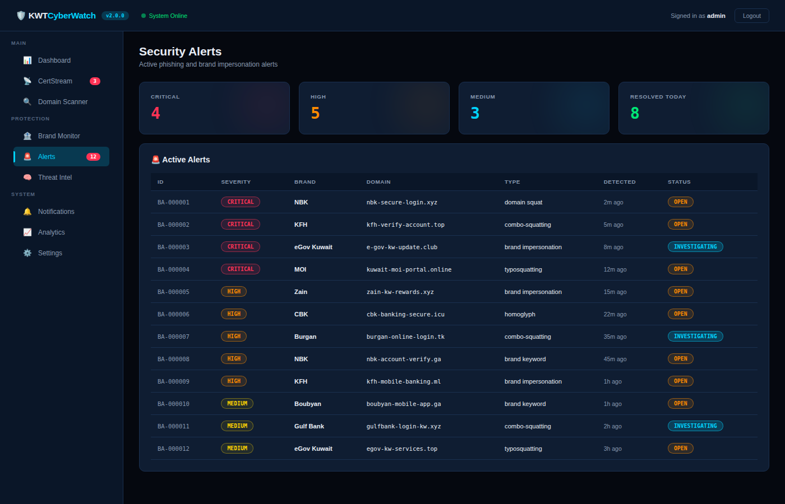
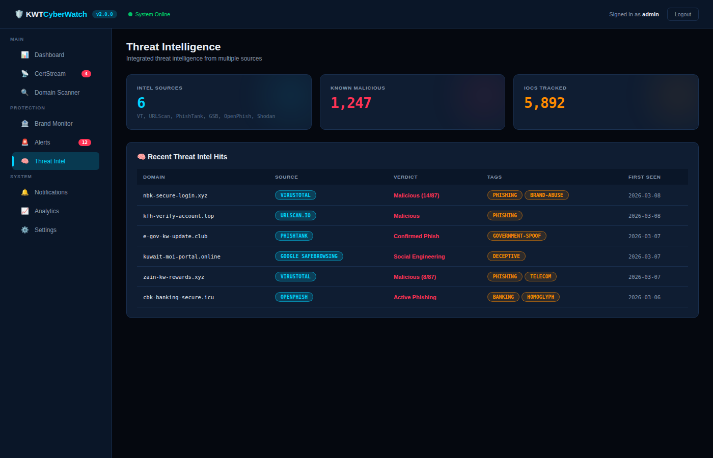
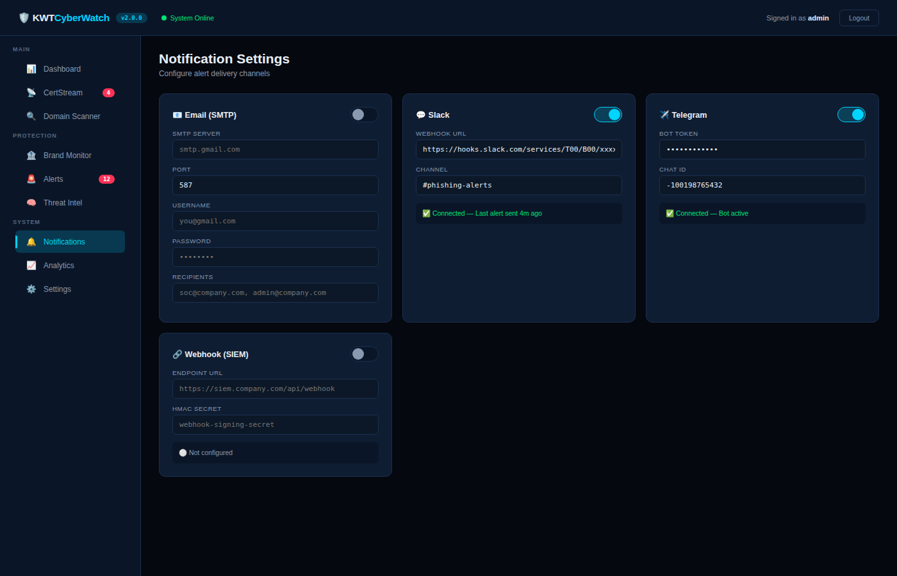
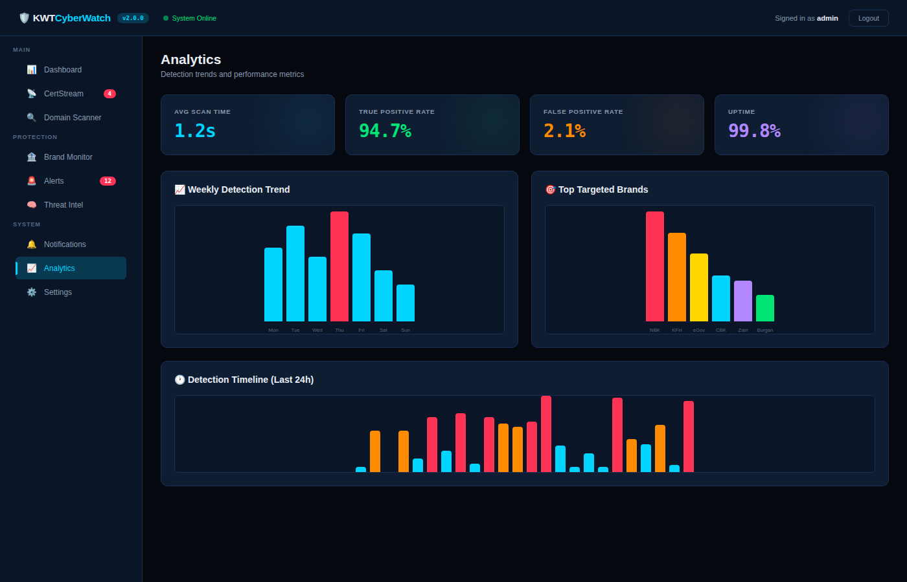

<p align="center">
  <h1 align="center">🛡️ KWTCyberWatch</h1>
  <p align="center">
    <strong>Kuwait Phishing Detection & Brand Protection Suite</strong>
  </p>
  <p align="center">
    Real-time Certificate Transparency monitoring, domain squatting detection, brand impersonation alerting, and integrated threat intelligence — purpose-built for Kuwait's digital ecosystem.
  </p>
  <p align="center">
    <a href="#features"></a>
    <a href="LICENSE"></a>
    <a href="https://www.python.org/"></a>
    <a href="https://github.com/SiteQ8/KWTCyberWatch/actions"></a>
    <a href="SECURITY.md"></a>
    <a href="https://github.com/SiteQ8/KWTCyberWatch/issues"></a>
  </p>
</p>

---

## 📸 Screenshots

### Login
<p align="center">
  
</p>

### Dashboard
<p align="center">
  
</p>

### CertStream Live Feed
<p align="center">
  
</p>

### Domain Scanner
<p align="center">
  
</p>

### Brand Protection Monitor
<p align="center">
  
</p>

### Security Alerts
<p align="center">
  
</p>

### Threat Intelligence
<p align="center">
  
</p>

### Notification Settings
<p align="center">
  
</p>

### Analytics
<p align="center">
  
</p>

---

## 🎯 Features

### Core Detection Engine
- **CertStream Monitor** — Real-time Certificate Transparency log ingestion with configurable keyword matching, risk scoring, and exponential backoff reconnection
- **Phishing Detector** — Multi-layered heuristic engine analyzing keywords, brand impersonation, TLD risk, domain structure, Shannon entropy, and IDN/punycode attacks
- **Domain Squatting Analyzer** — Detects typosquatting (Levenshtein), homoglyph attacks (Unicode confusables), combo-squatting, bitsquatting, vowel-swap, TLD-swap, hyphenation, and subdomain abuse
- **Brand Protection Monitor** — Pre-configured profiles for 14 Kuwait organizations (NBK, KFH, CBK, Burgan, Gulf Bank, Boubyan, Warba, Zain, Ooredoo, eGov, MOI, Kuwait Airways, KNPC, KPC)
- **Domain Permutation Generator** — Generates all squatting variants of protected domains for proactive monitoring

### Web Dashboard
- **Interactive Demo UI** — Full-featured single-page application with login authentication
- **Real-time CertStream Feed** — Live visualization of matched certificates with risk scoring
- **Domain Scanner** — On-demand analysis with detailed indicator breakdown and recommendations
- **Brand Monitor Panel** — Overview of all protected brands with alert counts
- **Alert Management** — Severity-based alert triage with status tracking
- **Threat Intelligence View** — Consolidated intel from multiple sources
- **Analytics Dashboard** — Detection trends, category breakdowns, hourly timelines, and brand targeting statistics
- **Notification Configuration** — Visual setup for Email, Slack, Telegram, and Webhook integrations
- **Settings Panel** — Keyword management, detection thresholds, API configuration, and TI API keys

### Notification System
- **Email** — SMTP with HTML-formatted alert templates
- **Slack** — Rich Block Kit messages via webhook
- **Telegram** — Bot API with Markdown formatting
- **Webhook** — Generic HTTPS endpoint with HMAC-SHA256 signing (SIEM integration)
- **Central Dispatcher** — Routes alerts to all configured channels with severity filtering

### Threat Intelligence Integration
- VirusTotal API v3
- URLScan.io
- PhishTank
- Google Safe Browsing
- OpenPhish
- Shodan (configurable)

### REST API
| Endpoint | Method | Description |
|---|---|---|
| `/api/v1/scan/domain` | POST | Analyze a single domain |
| `/api/v1/scan/bulk` | POST | Bulk scan up to 100 domains |
| `/api/v1/brands` | GET | List monitored brands |
| `/api/v1/brands/permutations` | POST | Generate squatting permutations |
| `/api/v1/alerts` | GET | Retrieve filtered alerts |
| `/api/v1/stats` | GET | Dashboard statistics |
| `/api/v1/certstream/status` | GET | Monitor status |
| `/api/v1/auth/login` | POST | Authentication |
| `/api/v1/health` | GET | Health check |

---

## 🚀 Quick Start

### Demo (No Installation Required)

Open `demo/index.html` in any browser. Login with:
- **Username:** `admin`
- **Password:** `admin`

### Installation

```bash
# Clone the repository
git clone https://github.com/SiteQ8/KWTCyberWatch.git
cd KWTCyberWatch

# Create virtual environment
python -m venv venv
source venv/bin/activate

# Install dependencies
pip install -r requirements.txt

# Copy and edit configuration
cp config.yaml config.local.yaml
# Edit config.local.yaml with your API keys and settings
```

### Usage

```bash
# Start the API server with dashboard
python main.py api

# Start CertStream real-time monitoring
python main.py monitor

# Scan a specific domain
python main.py scan nbk-secure-login.xyz

# Start demo mode
python main.py demo
```

### Docker

```bash
# Build and run
docker-compose up -d

# API available at http://localhost:5000
# Monitor runs as a separate service
```

---

## 📁 Project Structure

```
KWTCyberWatch/
├── main.py                          # CLI entry point
├── config.yaml                      # Configuration file
├── requirements.txt                 # Python dependencies
├── setup.py                         # Package setup
├── Dockerfile                       # Container image
├── docker-compose.yml               # Multi-service deployment
├── src/
│   ├── core/
│   │   ├── certstream_monitor.py    # CertStream CT log monitor
│   │   ├── phishing_detector.py     # Multi-layered phishing detection
│   │   ├── domain_analyzer.py       # Domain squatting analysis
│   │   ├── brand_monitor.py         # Brand protection engine
│   │   └── threat_intel.py          # Threat intelligence aggregator
│   ├── api/
│   │   └── app.py                   # Flask REST API server
│   ├── notifications/
│   │   └── dispatcher.py            # Email, Slack, Telegram, Webhook
│   ├── utils/
│   │   └── network.py               # DNS, WHOIS, SSL utilities
│   ├── models/
│   │   └── database.py              # SQLite storage layer
│   └── config/
│       └── settings.py              # Configuration management
├── demo/
│   └── index.html                   # Interactive web dashboard
├── tests/
│   └── test_core.py                 # Test suite
├── docs/
│   └── screenshots/                 # Dashboard screenshots
├── scripts/
│   └── screenshots.py               # Screenshot automation
├── .github/
│   ├── workflows/
│   │   ├── ci.yml                   # CI pipeline (test, lint, docker)
│   │   └── security.yml             # Security scanning (CodeQL, Bandit, etc.)
│   ├── ISSUE_TEMPLATE/
│   │   ├── bug_report.md
│   │   ├── feature_request.md
│   │   └── security.md
│   ├── PULL_REQUEST_TEMPLATE.md
│   └── dependabot.yml
├── CODEOWNERS
├── CODE_OF_CONDUCT.md
├── CONTRIBUTING.md
├── SUPPORT.md
├── SECURITY.md
├── CHANGELOG.md
└── LICENSE
```

---

## ⚙️ Configuration

Edit `config.yaml` to customize:

```yaml
certstream:
  keywords: [kuwait, kw, nbk, kfh, ...]  # Monitoring keywords

notifications:
  slack_enabled: true
  slack_webhook_url: "https://hooks.slack.com/..."

threat_intel:
  virustotal_api_key: "your-key-here"
```

Environment variables override config file:
- `KCW_VT_API_KEY` — VirusTotal API key
- `KCW_SLACK_WEBHOOK` — Slack webhook URL
- `KCW_TELEGRAM_TOKEN` — Telegram bot token
- `KCW_API_SECRET` — API secret key

---

## 🔐 Security

See [SECURITY.md](SECURITY.md) for vulnerability reporting and security policy.

- Automated dependency scanning via Dependabot
- CodeQL analysis on every push
- Bandit security linting
- TruffleHog secrets scanning

---

## 🤝 Contributing

See [CONTRIBUTING.md](CONTRIBUTING.md) for guidelines.

Areas needing help:
- Additional Kuwait brand profiles
- Threat intelligence feed integrations
- Machine learning detection models
- Arabic language support
- Testing and documentation

---

## 📄 License

MIT License — see [LICENSE](LICENSE) for details.

---

## 👨‍💻 Author

**Ali AlEnezi** ([@SiteQ8](https://github.com/SiteQ8))
- Email: Site@hotmail.com
- Focus: Cybersecurity, Security Architecture, Offensive Security

---

<p align="center">
  <sub>Built with ❤️ for Kuwait's cybersecurity community</sub>
</p>
