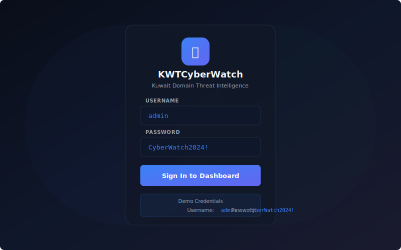
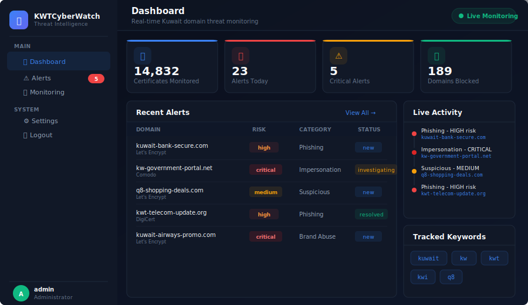
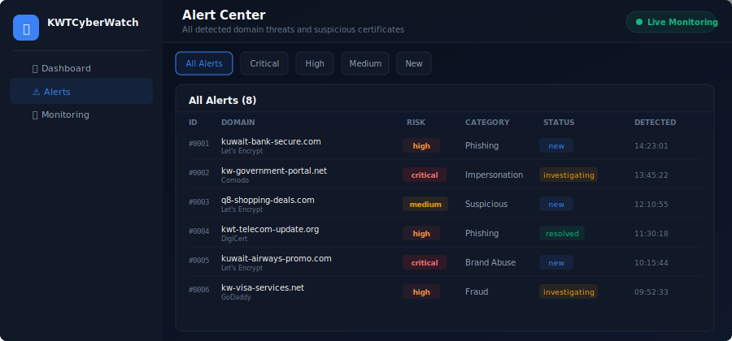
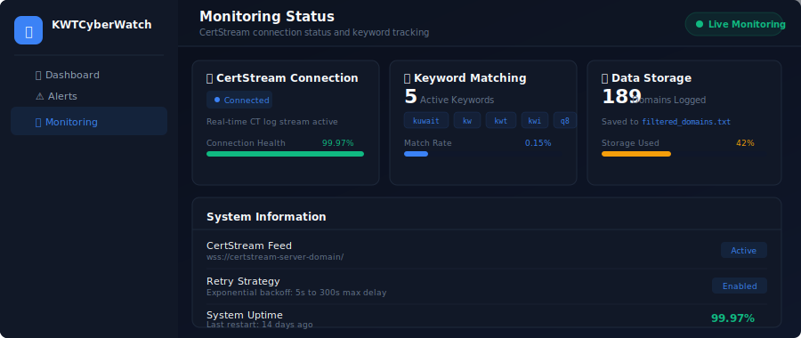

<div align="center">

# KWTCyberWatch

### Kuwait Domain Threat Intelligence Platform

Real-time SSL/TLS certificate monitoring for Kuwait-related domains using Certificate Transparency logs.

[](LICENSE)
[](https://python.org)
[](https://github.com/SiteQ8/KWTCyberWatch/actions/workflows/security.yml)
[](https://peps.python.org/pep-0008/)

</div>

---

## Overview

**KWTCyberWatch** monitors Certificate Transparency (CT) logs in real-time to detect newly issued SSL/TLS certificates for Kuwait-related domains. It helps identify potential phishing sites, brand impersonation, and other domain-based threats targeting Kuwait.

### Key Features

- **Real-time Monitoring** - Live CertStream feed watching CT logs 24/7
- **Smart Keyword Filtering** - Tracks domains matching: `kuwait`, `kw`, `kwt`, `kwi`, `q8`
- **Modern Web Dashboard** - Dark-themed threat intelligence UI with live alerts
- **Threat Categorization** - Automatic classification: Phishing, Impersonation, Brand Abuse, Fraud, Scam
- **Risk Scoring** - Critical, High, Medium, Low risk assessment
- **Auto-Reconnect** - Exponential backoff retry mechanism for production reliability
- **Domain Logging** - Persistent storage of all matched domains

---

## Screenshots

### Login Page
The secure login page with demo credentials displayed for easy testing.

<div align="center">



</div>

> **Demo Credentials:** Username: `admin` | Password: `CyberWatch2024!`

### Dashboard
Real-time threat monitoring dashboard with stats, recent alerts, live activity feed, and tracked keywords.

<div align="center">



</div>

### Alert Center
Full alert management with filtering by risk level (Critical, High, Medium) and status (New, Investigating, Resolved).

<div align="center">



</div>

### Monitoring Status
CertStream connection health, keyword matching rates, and system information.

<div align="center">



</div>

---

## Quick Start

### Prerequisites

- Python 3.10 or higher
- pip (Python package manager)

### Installation

```bash
# Clone the repository
git clone https://github.com/SiteQ8/KWTCyberWatch.git
cd KWTCyberWatch

# Create virtual environment
python3 -m venv venv
source venv/bin/activate  # Linux/macOS
# venv\Scripts\activate   # Windows

# Install dependencies
pip install -r requirements.txt
```

### Run the Web Dashboard

```bash
cd webapp
python app.py
```

Open your browser to **http://localhost:5000** and log in with:
- **Username:** `admin`
- **Password:** `CyberWatch2024!`

### Run the CertStream Monitor

```bash
# Basic monitor
python scripts/certstream_monitor.py

# Production monitor with auto-reconnect
python scripts/certstream_monitor_resilient.py
```

---

## Project Structure

```
KWTCyberWatch/
├── webapp/                          # Web dashboard application
│   ├── app.py                       # Flask application
│   ├── static/
│   │   └── css/
│   │       └── style.css            # Dashboard styles
│   └── templates/
│       ├── base.html                # Base template with sidebar
│       ├── login.html               # Login page
│       ├── dashboard.html           # Main dashboard
│       ├── alerts.html              # Alert center
│       ├── monitoring.html          # Monitoring status
│       └── settings.html            # Settings page
├── scripts/                         # Monitoring scripts
│   ├── certstream_monitor.py        # Basic CertStream monitor
│   └── certstream_monitor_resilient.py  # Production monitor with retry
├── docs/
│   └── screenshots/                 # UI screenshots
├── .github/
│   ├── workflows/
│   │   └── security.yml             # Security scanning CI
│   ├── ISSUE_TEMPLATE/
│   │   ├── bug_report.md            # Bug report template
│   │   ├── feature_request.md       # Feature request template
│   │   └── security_vulnerability.md # Security issue template
│   ├── PULL_REQUEST_TEMPLATE.md     # PR template
│   └── dependabot.yml               # Dependabot config
├── requirements.txt                 # Python dependencies
├── LICENSE                          # MIT License
├── CHANGELOG.md                     # Version history
├── CODE_OF_CONDUCT.md               # Community guidelines
├── CODEOWNERS                       # Code ownership
├── CONTRIBUTING.md                  # Contribution guidelines
├── SECURITY.md                      # Security policy
├── SUPPORT.md                       # Support information
└── .gitignore                       # Git ignore rules
```

---

## How It Works

1. **CertStream Connection** - Connects to Certificate Transparency log aggregator via WebSocket
2. **Domain Extraction** - Extracts domain names from newly issued certificates
3. **Keyword Matching** - Checks domains against Kuwait-related keywords
4. **Alert Generation** - Creates alerts with risk scoring and categorization
5. **Dashboard Display** - Shows real-time alerts in the web dashboard
6. **Domain Logging** - Saves matched domains to `filtered_domains.txt`

```
CT Logs → CertStream → KWTCyberWatch → Filter → Alert → Dashboard
                                          ↓
                                    filtered_domains.txt
```

---

## Configuration

### Environment Variables

| Variable | Default | Description |
|----------|---------|-------------|
| `SECRET_KEY` | `kwt-cyberwatch-dev-key` | Flask session secret key |
| `FLASK_DEBUG` | `True` | Enable debug mode |

### Monitored Keywords

Default keywords (configurable in scripts):
```python
KEYWORDS = ["kuwait", "kw", "kwt", "kwi", "q8"]
```

---

## Security

- See [SECURITY.md](SECURITY.md) for our security policy
- Report vulnerabilities via private disclosure (see SECURITY.md)
- Automated security scanning via GitHub Actions
- Dependency monitoring via Dependabot

---

## Contributing

We welcome contributions! Please see [CONTRIBUTING.md](CONTRIBUTING.md) for guidelines.

1. Fork the repository
2. Create a feature branch (`git checkout -b feature/amazing-feature`)
3. Commit your changes (`git commit -m 'Add amazing feature'`)
4. Push to the branch (`git push origin feature/amazing-feature`)
5. Open a Pull Request

---

## Support

Need help? See [SUPPORT.md](SUPPORT.md) for options:
- Open a GitHub Issue
- Check existing documentation
- Security issues: email security@kwtcyberwatch.com

---

## License

This project is licensed under the MIT License - see the [LICENSE](LICENSE) file for details.

---

## Acknowledgments

- [CertStream](https://certstream.calidog.io/) - Real-time certificate transparency log streaming
- [Flask](https://flask.palletsprojects.com/) - Web framework
- Certificate Transparency community

---

<div align="center">

**Built for Kuwait's Cybersecurity**

Made with dedication by [@SiteQ8](https://github.com/SiteQ8)

</div>
