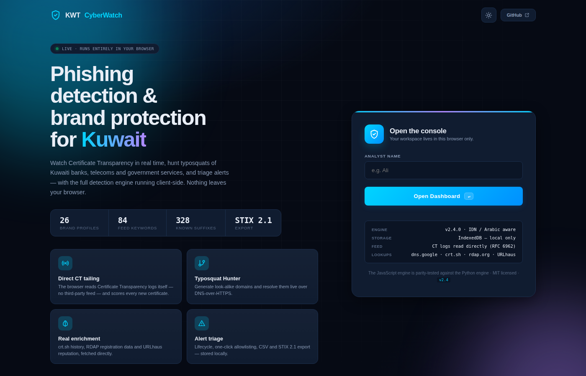
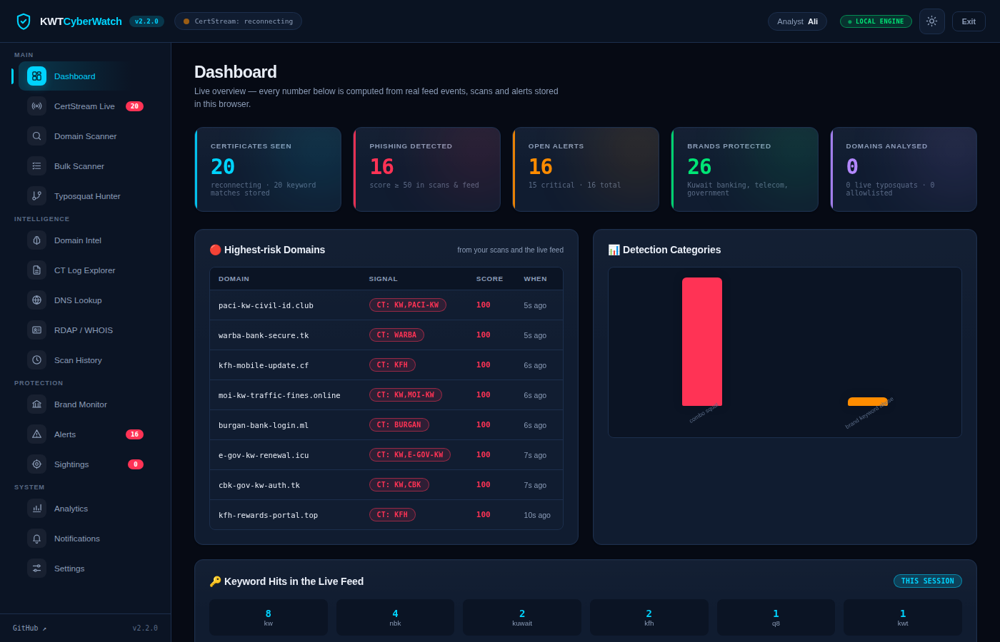
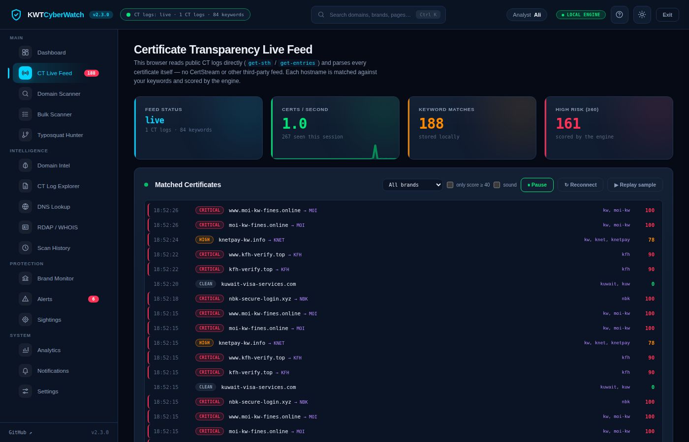
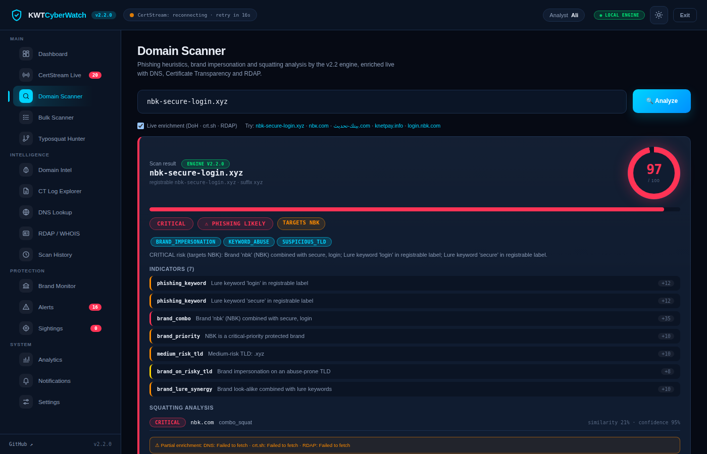
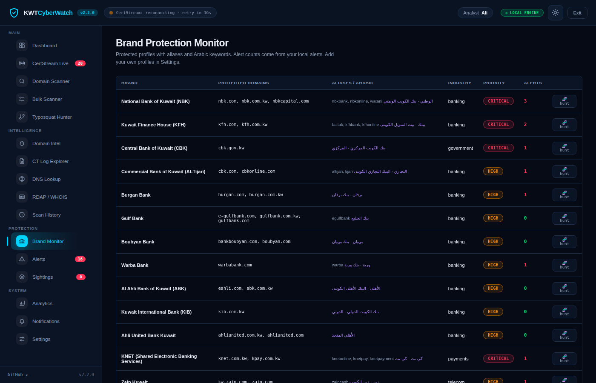
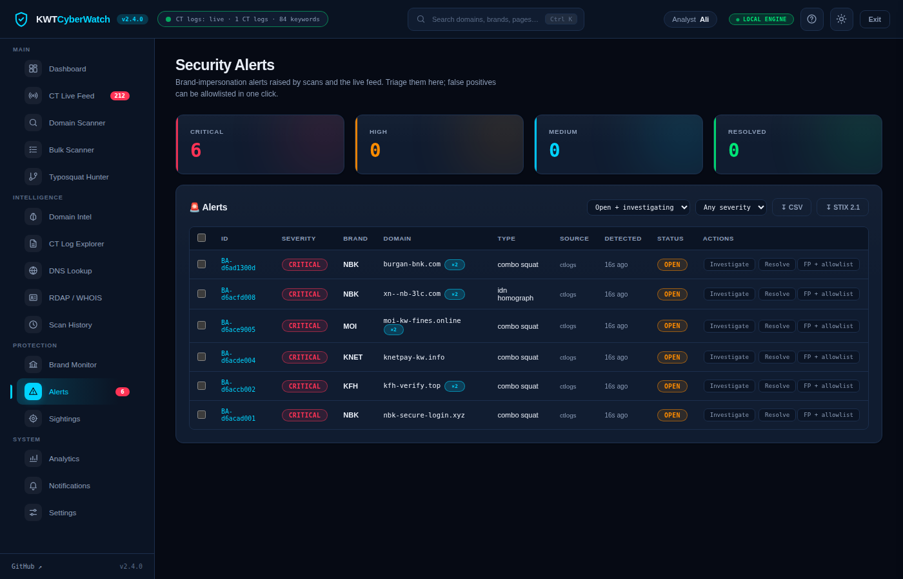
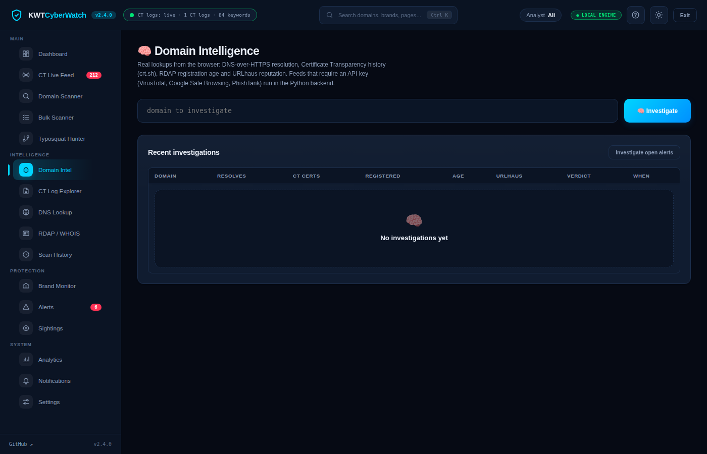
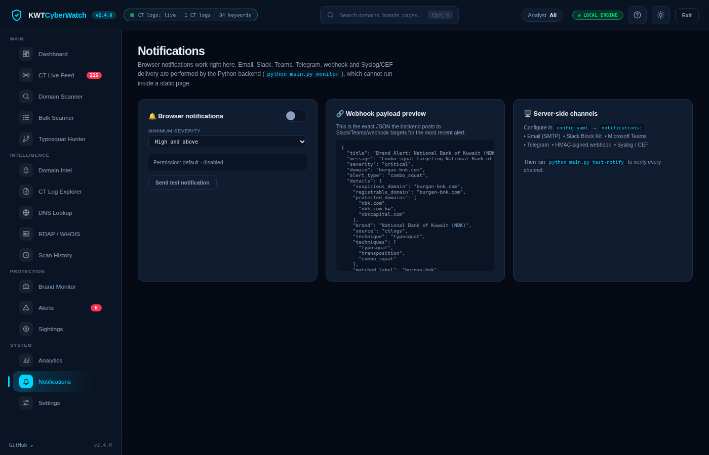
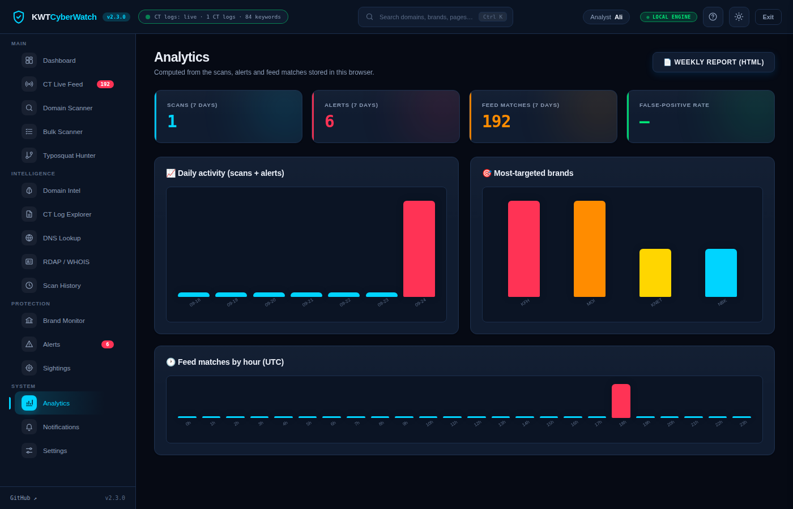

<p align="center">
  <h1 align="center">🛡️ KWTCyberWatch</h1>
  <p align="center">
    <strong>Kuwait Phishing Detection & Brand Protection Suite</strong>
  </p>
  <p align="center">
    Open-source phishing detection and brand protection for Kuwait: live Certificate Transparency monitoring, IDN/Arabic-aware typosquat and brand-impersonation detection for 26 Kuwaiti banks, telecoms and government services, alert triage, threat-intel enrichment and a fully client-side analyst console you can run from GitHub Pages.
  </p>
  <p align="center">
    <a href="#-features"></a>
    <a href="LICENSE"></a>
    <a href="https://www.python.org/"></a>
    <a href="https://github.com/SiteQ8/KWTCyberWatch/actions"></a>
    <a href="SECURITY.md"></a>
    <a href="https://github.com/SiteQ8/KWTCyberWatch/issues"></a>
  </p>
</p>

---

## ✨ What's new in 2.2

- **Real browser console** — the detection engine runs in JavaScript with parity tests against Python; the GitHub Pages demo streams the live CertStream feed, resolves typosquats over DNS-over-HTTPS and enriches with crt.sh, RDAP and URLhaus. No backend, no sample data.

## ✨ What's new in 2.1

- **Registrable-domain aware detection** — `login.nbk.com.kw`, `nbk.com.verify-login.tk` and `nbk-login.web.app` are all interpreted correctly thanks to a built-in public-suffix layer covering Kuwait, the GCC and free-hosting platforms.
- **IDN homograph, mixed-script and Arabic support** — `nbк.com` (Cyrillic *k*) and `بيتك-تحديث.com` are detected; 26 Kuwaiti brands ship with Arabic keywords.
- **Proactive typosquat watcher** — permutations of every protected brand are resolved on a schedule; a look-alike that goes live raises an alert *before* a certificate is ever issued.
- **Alert lifecycle** — persisted alerts with `open → investigating → resolved / false_positive`, assignees, notes, history and one-click allowlisting.
- **Threat intel that works out of the box** — OpenPhish and URLhaus need no key; VirusTotal, URLScan, PhishTank and Google Safe Browsing plug in with one.
- **SIEM-ready outputs** — STIX 2.1 bundles, CSV exports, Syslog/CEF and Microsoft Teams channels, Prometheus metrics.
- **Hardened API** — signed bearer tokens, roles, API keys, rate limiting, OpenAPI docs.
- **A real browser dashboard** — the full detection engine is ported to JavaScript (parity-tested against Python), so the [GitHub Pages demo](https://siteq8.github.io/KWTCyberWatch/demo/) scans for real, follows the live CertStream feed, resolves typosquats over DNS-over-HTTPS and enriches with crt.sh, RDAP and URLhaus. No backend, no sample data.
- **400+ offline tests** and a green CI (lint + tests + Docker).

---

## 📸 Screenshots

### Landing page
<p align="center">
  
</p>

### Dashboard
<p align="center">
  
</p>

### CertStream Live Feed
<p align="center">
  
</p>

### Domain Scanner
<p align="center">
  
</p>

### Brand Protection Monitor
<p align="center">
  
</p>

### Security Alerts
<p align="center">
  
</p>

### Threat Intelligence
<p align="center">
  
</p>

### Notification Settings
<p align="center">
  
</p>

### Analytics
<p align="center">
  
</p>

---

## 🎯 Features

### Detection engine
- **Domain parsing layer** — eTLD+1 extraction for `com.kw`, `gov.kw`, `edu.kw`, GCC/MENA and global second-level registries, plus 90+ free-hosting / tunnelling platforms (`web.app`, `github.io`, `pages.dev`, `ngrok-free.app`, `duckdns.org` …) that are both parsed as suffixes and flagged as an indicator.
- **Phishing detector** — weighted layers for lure keywords (English and Arabic), brand impersonation, TLD risk tiers, structure (deep subdomains, hyphen/digit padding, embedded `-com`/`-gov` tokens, fake *ministry*/*gov* wording outside `gov.kw`), Shannon entropy, IDN/mixed-script analysis, free hosting and certificate context (free CA + wildcard). Every verdict explains itself (`explanation`, per-indicator weights, matched brands).
- **Squatting analyzer** — typosquats (omission, transposition, repetition, insertion, keyboard, vowel swap, bitsquat), homoglyphs, leetspeak (`nbk0nline`), hyphenation (`k-net`), combo-squats (`knetpay`, `moi-fines`), TLD swaps and subdomain abuse. Edit-distance thresholds scale with brand length and short-brand matches require context, so `nbc.com`, `kibana.io`, `mohammed.com` and `pacific.com` stay clean.
- **Permutation generator** — thousands of technique-tagged candidates per brand across configurable TLDs (`main.py permutations nbk.com --tlds com kw com.kw --resolve`).

### Brand protection
- **26 built-in Kuwait profiles** with aliases, Arabic keywords, industry and priority:

  | Sector | Brands |
  |---|---|
  | Banking & payments | NBK, KFH, CBK (central bank), Al-Tijari (CBK), Burgan, Gulf Bank, Boubyan, Warba, ABK, KIB, Ahli United, **KNET / KPay** |
  | Telecom | Zain, Ooredoo, stc |
  | Government | eGov / Sahel, MOI, PACI (Civil ID), MOH, MOE |
  | Aviation, energy, markets, e-commerce | Kuwait Airways, Jazeera Airways, KNPC, KPC, Boursa Kuwait, Talabat |

- **Custom profiles** via `brands:` in `config.yaml` (merge with or replace the defaults).
- **Noise control** — legitimate brand infrastructure is never reported, one alert per (brand, domain) per dedupe window, and a strong match against one brand suppresses weak matches against others.
- **Alert lifecycle** — persisted with severity, numeric risk score, status, assignee, notes and change history; resolving as `false_positive` can allowlist the domain in the same call.

### Proactive typosquat watcher
`main.py watch-squats` (or the `kwtcyberwatch-watcher` container) generates permutations of every protected brand, resolves them concurrently and records **sightings** with first/last seen, IPs and a triage status (`new`, `monitoring`, `takedown_requested`, `resolved`, `benign`). New sightings are pushed to the notification channels.

### Threat intelligence & enrichment
| Source | Key needed | What it adds |
|---|---|---|
| OpenPhish feed | no | known phishing URLs (cached locally, refreshed hourly) |
| URLhaus (abuse.ch) | no | malware-distribution hosts |
| VirusTotal v3 | yes | engine verdicts, categories, reputation |
| Google Safe Browsing v4 | yes | SOCIAL_ENGINEERING / MALWARE matches |
| PhishTank | yes | community-verified phish |
| URLScan.io | yes | historical scans and verdicts |

Plus **RDAP** registration data (registrar, creation date, domain age, abuse contact), DNS records and TLS certificate details — `main.py scan <domain> --intel --enrich` or `GET /api/v1/enrich/<domain>`.

### Notifications
| Channel | Notes |
|---|---|
| Email (SMTP) | HTML template |
| Slack | Block Kit |
| Microsoft Teams | MessageCard webhook |
| Telegram | Bot API, Markdown |
| Generic webhook | HMAC-SHA256 signature (`X-KCW-Signature`) |
| Syslog / CEF | UDP or TCP, ArcSight CEF for any SIEM |

Minimum severity, per-domain cooldown de-duplication and delivery statistics are built into the dispatcher (`main.py test-notify` checks every channel).

### Exports & reporting
- **STIX 2.1** indicator bundles with TLP markings and deterministic IDs (`/api/v1/export/stix`, `main.py export-stix`) for MISP, OpenCTI, Splunk ES, Sentinel.
- **CSV / JSON** alert exports, **Markdown / JSON** activity reports, **Prometheus** `/metrics`.

### Web dashboard
The single-page dashboard in `demo/` is a **real client-side analyst console**, not a mock-up.
Try it live at <https://siteq8.github.io/KWTCyberWatch/demo/>.

- **Browser-native detection engine** — `demo/engine.js` is a line-for-line port of the Python
  phishing detector, brand monitor and domain analyzer (26 Kuwaiti brand profiles, IDN/Arabic
  aware, permutation generator). Its data tables are generated from the Python source by
  `scripts/export_engine_data.py`, and `tests/test_js_engine.py` proves both engines return
  identical verdicts on a 90-domain corpus.
- **Live CertStream feed** — a WebSocket to `certstream.calidog.io` streams newly issued
  certificates; every hostname is scored by the engine, keyword hits are stored, and brand alerts
  are raised in the browser (desktop notifications optional).
- **Real enrichment** — DNS via Google DNS-over-HTTPS, Certificate Transparency history via
  crt.sh, registration data via RDAP (`rdap.org`) and URLhaus reputation, all fetched directly
  from the browser.
- **Typosquat Hunter** — generates permutations for any brand domain and resolves them live,
  recording resolving look-alikes as **sightings** with triage status.
- **Analyst console** — `Ctrl+K` command palette (scan / hunt / investigate / allowlist any
  domain, jump to brands, pages, alerts), an alert drawer with evidence, a character-level
  look-alike diff and Unicode inspector, notes, assignee, timeline and printable reports, bulk
  triage, sortable tables, sparklines, deep links (`#scan=…`, `#alert=…`) and a weekly HTML
  summary. Installable as a PWA and works offline once loaded.
- **Alert lifecycle, history, analytics, STIX 2.1 export** — everything persists in IndexedDB,
  so the console keeps state between visits; settings (keywords, allowlist, custom brands) rebuild
  the engine on the fly, and the whole workspace can be exported/imported as JSON.
- When served at `/` by `python main.py api` the dashboard also detects the backend and reports
  its version; scans still run locally, so the demo behaves the same online and offline.

---

## 🚀 Quick Start

### Demo (no installation)
Visit <https://siteq8.github.io/KWTCyberWatch/demo/> or open `demo/index.html` locally — the engine, feed and lookups all run in your browser.

### Installation

```bash
git clone https://github.com/SiteQ8/KWTCyberWatch.git
cd KWTCyberWatch
python -m venv venv && source venv/bin/activate
pip install -r requirements.txt

cp config.yaml config.local.yaml      # git-ignored; put keys and webhooks here
export KCW_ADMIN_PASSWORD='a-strong-password'
export KCW_API_SECRET='a-long-random-secret'
```

### Command line

| Command | Purpose |
|---|---|
| `python main.py api` / `demo` | API server + dashboard on <http://localhost:5000> (docs at `/api/v1/docs`) |
| `python main.py monitor` | Live CertStream monitoring (`--replay capture.jsonl` to re-process a capture) |
| `python main.py scan nbk-login.xyz [--json] [--intel] [--enrich]` | Analyse one domain |
| `python main.py bulk domains.txt [--csv out.csv]` | Analyse a list (or `-` for stdin) |
| `python main.py permutations nbk.com --tlds com kw com.kw --resolve` | Generate and resolve squatting candidates |
| `python main.py watch-squats [--once] [--brand nbk.com]` | Proactive typosquat discovery |
| `python main.py report [--days 7] [--json] [--out report.md]` | Activity report |
| `python main.py allowlist list \| add \| remove <domain>` | Manage the allowlist |
| `python main.py export-stix --out indicators.json` | STIX 2.1 export |
| `python main.py config [--check]` | Show effective configuration and warnings |
| `python main.py test-notify` | Send a test alert to every channel |

```text
$ python main.py --no-banner scan nbk-secure-login.xyz

  Scanning: nbk-secure-login.xyz
  Registrable: nbk-secure-login.xyz   Suffix: xyz   IDN: no

  Phishing Detection:
    Risk Score:  100.0/100 🔴
    Risk Level:  CRITICAL
    Categories:  brand_impersonation, keyword_abuse, suspicious_tld
    Brands:      NBK

  Indicators (7):
    • phishing_keyword: Lure keyword 'login' in registrable label (+12)
    • brand_combo: Brand 'nbk' (NBK) combined with secure, login (+35)
    • brand_priority: NBK is a critical-priority protected brand (+10)
    • medium_risk_tld: Medium-risk TLD: .xyz (+10)
    ...
  Brand Alerts (1):
    [CRITICAL] National Bank of Kuwait (NBK): Combo-squat targeting ... nbk-secure-login.xyz
```

### Docker

```bash
docker compose up -d        # api (:5000) + certstream monitor + squat watcher
```

Secrets are passed through `KCW_*` environment variables (see `docker-compose.yml`).

---

## 🔌 REST API

Base path `/api/v1`. Read endpoints are open by default (set `api.auth_required: true` to change that); mutating endpoints always need a **bearer token** from `/auth/login` or an `X-API-Key` header.

| Endpoint | Method | Description |
|---|---|---|
| `/auth/login` · `/auth/me` | POST · GET | Obtain / inspect a signed token (roles: admin, analyst) |
| `/scan/domain` | POST | Full analysis; `intel`, `enrich`, `persist` flags |
| `/scan/bulk` | POST | Up to `max_bulk_domains` hostnames |
| `/scans/history` | GET | Recent scans |
| `/brands` · `/brands/permutations` | GET · POST | Profiles with alert counts; technique-tagged permutations |
| `/alerts` · `/alerts/<id>` | GET · GET/PATCH | Filter, paginate, triage (status, assignee, notes, `allowlist`) |
| `/alerts/export?format=csv\|json\|stix` | GET | Alert export |
| `/allowlist` · `/allowlist/<domain>` | GET/POST · DELETE | Allowlist management |
| `/intel/<domain>` | GET | Threat-intel lookup (`?refresh=1`) |
| `/enrich/<domain>` | GET | DNS, RDAP, TLS (`?tls=1&whois=1`) |
| `/squats/sightings` · `/squats/sightings/<domain>` | GET · PATCH | Live typosquats and triage |
| `/squats/check` | POST | Resolve permutations of one brand now |
| `/stats` · `/reports/summary?days=7&format=markdown` | GET | Dashboard statistics, activity report |
| `/export/stix?min_risk=40&tlp=amber` | GET | STIX 2.1 bundle |
| `/certstream/status` · `/certstream/events` | GET | Monitor heartbeat and recent matches |
| `/config` | GET | Effective configuration, secrets masked (admin) |
| `/health` · `/openapi.json` · `/docs` · `/metrics` | GET | Health, OpenAPI 3, Swagger UI, Prometheus |

```bash
TOKEN=$(curl -s -X POST localhost:5000/api/v1/auth/login \
  -H 'Content-Type: application/json' -d '{"username":"admin","password":"..."}' | jq -r .token)

curl -X PATCH localhost:5000/api/v1/alerts/BA-1a2b3c4d5e \
  -H "Authorization: Bearer $TOKEN" -H 'Content-Type: application/json' \
  -d '{"status":"false_positive","allowlist":true,"notes":"our marketing microsite"}'
```

---

## ⚙️ Configuration

`config.yaml` is fully documented. Resolution order: `--config PATH` → `$KCW_CONFIG` → `config.local.yaml` → `config.yaml`; `KCW_*` environment variables override everything.

```yaml
domain_analysis:
  allowlist: [marketing-nbk.com]          # never reported
brands:                                   # extra profiles merged with the built-ins
  - name: My Bank
    domains: [mybank.com.kw]
    keywords: [mybank, my bank kuwait]
    arabic_keywords: [بنكي]
    priority: critical
squat_watcher:
  tlds: [com, net, kw, com.kw, xyz, top]
  interval_seconds: 21600
notifications:
  min_severity: high
  teams_enabled: true
  syslog_enabled: true
  syslog_host: siem.internal
api:
  auth_required: true
  rate_limit: 300/hour
```

| Variable | Overrides |
|---|---|
| `KCW_API_SECRET`, `KCW_API_KEY`, `KCW_ADMIN_PASSWORD`, `KCW_ANALYST_PASSWORD`, `KCW_AUTH_REQUIRED`, `KCW_RATE_LIMIT`, `KCW_API_HOST`, `KCW_API_PORT` | API |
| `KCW_VT_API_KEY`, `KCW_URLSCAN_KEY`, `KCW_GSB_KEY`, `KCW_PHISHTANK_KEY`, `KCW_SHODAN_KEY`, `KCW_ABUSEIPDB_KEY` | Threat intel |
| `KCW_SLACK_WEBHOOK`, `KCW_TEAMS_WEBHOOK`, `KCW_TELEGRAM_TOKEN`, `KCW_TELEGRAM_CHAT`, `KCW_WEBHOOK_URL`, `KCW_WEBHOOK_SECRET`, `KCW_SMTP_PASSWORD`, `KCW_MIN_SEVERITY` | Notifications |
| `KCW_DB_PATH`, `KCW_DATA_DIR`, `KCW_LOG_LEVEL`, `KCW_CERTSTREAM_URL`, `KCW_CONFIG` | Storage, logging, config file |

`python main.py config --check` prints warnings for insecure defaults (default secret, demo password, debug mode, misconfigured channels).

---

## 📁 Project Structure

```
KWTCyberWatch/
├── main.py                          # CLI entry point (api, monitor, scan, bulk, watch-squats, report ...)
├── config.yaml                      # Documented configuration
├── pyproject.toml / .flake8         # black (100 cols), pytest, flake8 settings
├── src/
│   ├── __init__.py                  # __version__
│   ├── core/
│   │   ├── constants.py             # keyword lists, TLD risk tiers, Arabic lures
│   │   ├── phishing_detector.py     # multi-layer scoring engine
│   │   ├── domain_analyzer.py       # squatting techniques & permutation generator
│   │   ├── brand_monitor.py         # 26 Kuwait brand profiles, alert generation
│   │   ├── squat_watcher.py         # proactive permutation resolver
│   │   ├── certstream_monitor.py    # CT log monitor with heartbeat & persistence
│   │   ├── threat_intel.py          # OpenPhish, URLhaus, VT, GSB, PhishTank, URLScan
│   │   ├── engine.py                # shared wiring + scan pipeline (API & CLI)
│   │   ├── reports.py               # summaries, Markdown, CSV, Prometheus
│   │   └── stix_export.py           # STIX 2.1 bundles
│   ├── api/
│   │   ├── app.py                   # Flask factory & routes
│   │   ├── auth.py                  # signed tokens, users, API keys
│   │   ├── ratelimit.py             # sliding-window limiter
│   │   └── openapi.py               # OpenAPI 3 document + Swagger UI
│   ├── notifications/dispatcher.py  # Email, Slack, Teams, Telegram, Webhook, Syslog/CEF
│   ├── utils/
│   │   ├── domain.py                # parsing, suffixes, IDN, confusables, Arabic
│   │   └── network.py               # DNS, RDAP, WHOIS, TLS enrichment
│   ├── models/database.py           # SQLite storage with migrations
│   └── config/settings.py           # dataclass settings, YAML + env loading, validation
├── demo/                            # Browser console: index.html, engine.js (JS port), engine-data.js (generated), app.js, features.js, sw.js
├── tests/                           # 420+ offline tests (incl. Python↔JS engine parity)
├── docs/screenshots/
├── Dockerfile · docker-compose.yml  # api + monitor + watcher
└── .github/workflows/               # CI (tests, lint, Docker) and security scanning
```

---

## 🧪 Development

```bash
pip install -r requirements.txt
pytest tests/ -v --cov=src            # all tests run offline
flake8 src/ tests/ main.py
black --check src/ tests/ main.py
```

---

## 🔐 Security

See [SECURITY.md](SECURITY.md) for vulnerability reporting and the security policy.

- Change `api.secret_key` and `api.admin_password` before exposing the API (`main.py config --check` reminds you)
- Automated dependency scanning via Dependabot, CodeQL analysis, Bandit and TruffleHog in CI
- Tokens are HMAC-signed and expire; rate limiting and security headers are on by default

---

## 🤝 Contributing

See [CONTRIBUTING.md](CONTRIBUTING.md). Areas needing help:
- Additional Kuwait and GCC brand profiles (`brands:` in `config.yaml` is a great way to prototype)
- More threat-intelligence feeds
- Machine-learning detection models
- Dashboard polish: charts for the new endpoints, dark/light theme, Arabic UI
- Documentation and translations

---

## 📄 License

MIT License — see [LICENSE](LICENSE) for details.

---

## 👨‍💻 Author

**Ali AlEnezi** ([@SiteQ8](https://github.com/SiteQ8))
- Email: Site@hotmail.com

---

<p align="center">
  <sub>Built with ❤️ for Kuwait's cybersecurity community</sub>
</p>
